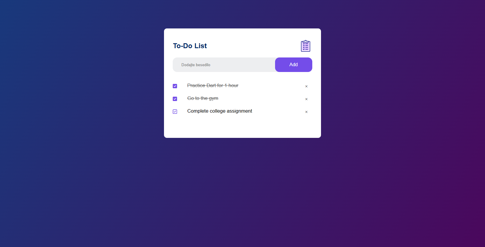

# ToDo App

  
*A simple todo app.*

A minimalist todo webapp built with HTML, CSS, and JavaScript. Tasks are automatically saved to local storage, so they stay after closing the browser.

## Features
- ✅ Add new todos
- ❌ Delete tasks permanently
- ✔️ Toggle task completion
- 📦 Automatic local storage (no data loss on refresh/close)

## Usage
1. Add tasks: Type in the input field and press Enter/click Add
2. Complete tasks: Click the checkbox
3. Delete tasks: Click the trash icon

## Installation
Run locally in 2 steps:
```bash
git clone https://github.com/DenisHafi/ToDo.git
open index.html
